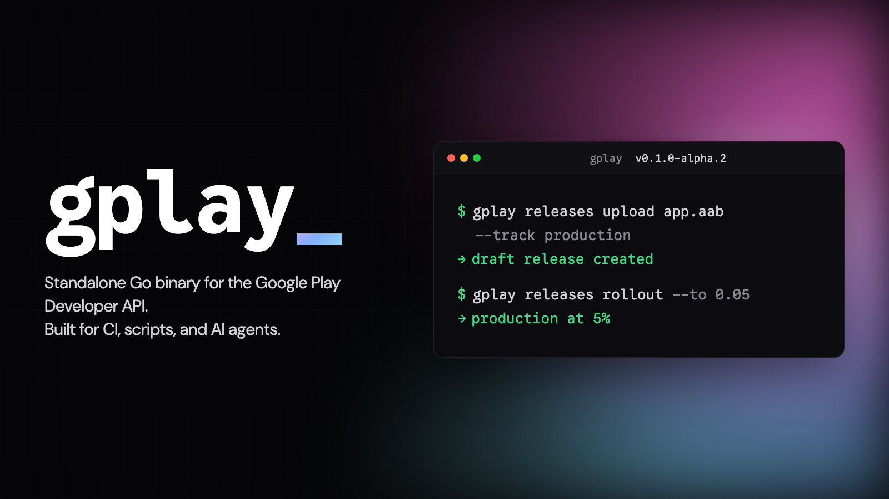

<p align="center">
  
</p>

<p align="center">
  <a href="https://gplay.sh"></a>
  <a href="https://github.com/PollyGlot/google-play-cli/releases"></a>
  <a href="https://github.com/PollyGlot/google-play-cli/stargazers"></a>
  
  
  
</p>

# gplay

Every team shipping an Android app eventually hits the same wall: Fastlane
`supply` drags a Ruby runtime into your CI image, output meant for humans,
and generic exit codes that make retry logic guesswork. `gplay` is what
you'd build today if you started fresh — one static binary, no runtime,
JSON output that matches the Google Play Developer API verbatim, semantic
exit codes, safe production defaults.

**Two ways to drive it:** the raw CLI (flags, scripts, CI) or
[agent skills](#agent-skills) that run it from natural-language prompts.

> **Public preview — pre-1.0.** A broad surface is already implemented: auth,
> apps, releases, tracks, reviews, metadata, compliance (Data Safety), team,
> and closed-track testers. Breaking changes are still possible before `v1.0`.
> See [docs/BACKLOG.md](docs/BACKLOG.md) for what's out of scope and
> [ADR-0010](docs/adr/0010-versioning-public-contract-and-ga.md) for the
> versioning policy.

## Why

- **Standalone Go binary.** No Ruby, no Node, no Python — one file in your CI
  image.
- **Built for CI and agents.** TTY-aware output (`table` by default, `json`
  in pipes), explicit flags, semantic exit codes for retry decisions.
- **API-faithful.** `--output json` returns the raw Google Play Developer
  API response shape — no custom envelope to learn. The Google docs *are* the
  schema docs.
- **Safe by default on production.** Uploading or promoting to the
  `production` track creates a `draft` release unless you explicitly
  `--complete` or `--staged <fraction>`.
  See [ADR-0002](docs/adr/0002-safe-production-defaults.md).

## Install

All install methods are live: `go install`, Homebrew, the install script, and
pre-built binaries for Linux, macOS, and Windows on the
[releases page](https://github.com/PollyGlot/google-play-cli/releases).

```bash
# go install
go install github.com/PollyGlot/google-play-cli/cmd/gplay@latest

# Homebrew
brew install PollyGlot/tap/gplay

# Install script
curl -fsSL https://gplay.sh/install | sh
```

The install script verifies the archive's SHA-256 against the release
`checksums.txt` and **fails closed** — a missing, incomplete, or mismatched
checksum aborts the install. Set `GPLAY_INSTALL_NO_VERIFY=1` to bypass (prints
a warning, greppable in CI). To add cosign and provenance checks on top, see
[Verify a release](#verify-a-release).

## Agent skills

`gplay` is built to be driven by AI agents, not just typed by hand. Agent
skills turn a natural-language prompt into the right `gplay` invocation, with
the safety rails baked in:

> *"Promote the latest internal build of com.example.myapp to beta."*
> → the `gplay-release-flow` skill runs `gplay releases promote --from
> internal --to beta` for you.

Install them in one step — the **one** gplay command that needs Node/npx:

```bash
gplay install-skills
```

That wraps the skills CLI (`npx skills add PollyGlot/google-play-cli-skills
--global --agent '*' --yes`), installing every skill for every detected agent.
No Node? Run that `npx` line yourself, or browse the skills by hand. (Driving
the Play API itself stays Node-free — `install-skills` is a workstation
convenience, never on the CI path.)

Skills live in a companion repo —
[**PollyGlot/google-play-cli-skills**](https://github.com/PollyGlot/google-play-cli-skills).
Each is a folder with a `SKILL.md` documenting its intent, the commands it
runs, and the rails it enforces. The roster is fixed by
[ADR-0021](docs/adr/0021-companion-skills-repo.md): one skill per shipped
namespace, plus a `gplay-cli-usage` foundation.

| Skill | Drives |
|---|---|
| `gplay-cli-usage` | Cross-cutting conventions (foundation) |
| `gplay-setup` | Auth onboarding |
| `gplay-apps` | Apps registry + details |
| `gplay-release-flow` | upload / promote / rollout |
| `gplay-tracks` | Tracks + testers |
| `gplay-reviews` | reviews list / reply |
| `gplay-metadata-sync` | Listings + images |
| `gplay-compliance` | Data Safety |
| `gplay-team` | users / grants / permissions |

`gplay-vitals` and `gplay-subscription-management` are gated until those CLI
surfaces land ([#49](https://github.com/PollyGlot/google-play-cli/issues/49),
[#51](https://github.com/PollyGlot/google-play-cli/issues/51)).

## Quick start

```bash
# Point gplay at a Google Cloud service account JSON.
gplay auth login --service-account ./service_account.json

# List configured accounts and see which one is active.
gplay auth list
gplay auth status

# Verify the SA actually has access to your app.
gplay auth doctor --package com.example.myapp

# Bootstrap a project-local config (cascading: project → user → defaults).
gplay init
```

Full command reference: `gplay --help` (or `gplay <subcommand> --help`).

## The Fastlane-replacement surface

The CLI the skills above drive — all working today (public preview):

```bash
# Upload an AAB to the internal track, with localized release notes.
gplay releases upload app.aab \
  --package com.example.myapp \
  --track internal \
  --release-notes-dir ./whatsnew

# Promote the latest internal build to beta.
gplay releases promote --package com.example.myapp --from internal --to beta

# Stage a production rollout, then advance it.
gplay releases rollout --package com.example.myapp --track production --to 0.10

# Read the most recent reviews (API exposes the last 7 days only) and reply.
gplay reviews list --package com.example.myapp --stars 1-2
gplay reviews reply --review-id REVIEW_ID --reply "Thanks for the feedback!"
```

## How it's set up

Documentation-first: decisions are pinned before code so contributors and
agents converge.

- [**CLAUDE.md**](CLAUDE.md) — project context and agent working
  instructions (read order, conventions, build/test, PR gate).
- [**CONTEXT.md**](CONTEXT.md) — glossary of canonical terms (Edit,
  Account, Project, ...). Use them verbatim.
- [**docs/DESIGN.md**](docs/DESIGN.md) — CLI conventions across commands
  (auth precedence, exit codes, output format, verbosity, edit lifecycle).
- [**docs/BACKLOG.md**](docs/BACKLOG.md) — explicitly out-of-scope features.
- [**docs/CI_CD.md**](docs/CI_CD.md) — how to wire `gplay` into a CI
  pipeline (GitHub Actions example).
- [**docs/adr/**](docs/adr/) — Architecture Decision Records.

## Verify a release

<details>
<summary>Confirm an artifact came from this repo's release pipeline (cosign + provenance).</summary>

Every release publishes a cosign signature over `checksums.txt` and a GitHub
build-provenance attestation over each archive — two independent ways to
confirm an artifact really came from this repo's release pipeline before you
trust it in CI.

```bash
# 1. Build-provenance attestation (needs the GitHub CLI; no extra download).
#    Proves the archive was built by this repo's release workflow.
gh attestation verify gplay_<version>_<os>_<arch>.tar.gz \
  -R PollyGlot/google-play-cli

# 2. cosign signature over checksums.txt (needs cosign). The checksum file
#    transitively covers every archive it lists, so verify it, then check
#    your archive against it.
cosign verify-blob checksums.txt \
  --bundle checksums.txt.sigstore.json \
  --certificate-identity-regexp '^https://github.com/PollyGlot/google-play-cli/\.github/workflows/release\.yml@' \
  --certificate-oidc-issuer https://token.actions.githubusercontent.com
shasum -a 256 -c <(grep " gplay_<version>_<os>_<arch>.tar.gz$" checksums.txt)
```

Download `checksums.txt` and `checksums.txt.sigstore.json` from the same
[release](https://github.com/PollyGlot/google-play-cli/releases) as the
archive. The install script already checks the SHA-256 against `checksums.txt`
and [fails closed](#install); these commands add provenance and signature
verification on top.

</details>

## Contributing

See [CONTRIBUTING.md](CONTRIBUTING.md). TL;DR: open an issue first for
anything bigger than a typo, branch from `main`, open a PR.

## License

[MIT](LICENSE) — © 2026 Pavlo Trinko and contributors.

## Not affiliated with Google

`gplay` is an independent open-source project. It uses the public Google
Play Developer API and is not endorsed by, affiliated with, or sponsored by
Google LLC. "Google Play" is a trademark of Google LLC.
