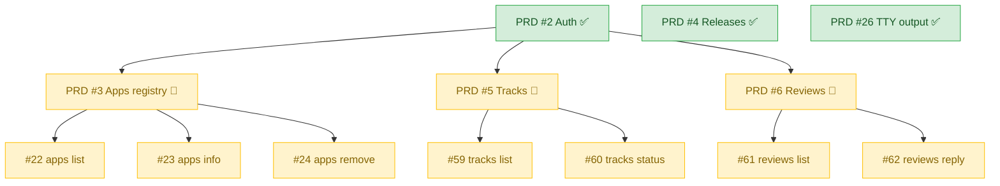

# Roadmap

Vue d'ensemble de la structure des issues du projet. Mise à jour à chaque
nouveau PRD ou nouvelle décomposition via `/to-issues`.

## Types d'issues

| Type | Label | Convention de titre | Rôle |
|---|---|---|---|
| **PRD** | `type:prd` | `PRD: <area>` ou `PRD — <area>` | Spec complète d'un area, décomposable via `/to-issues` |
| **Slice** | `type:slice` | libre (préfixée par l'area, ex: `Apps: gplay apps list`) | Sous-issue d'un PRD, tracer-bullet vertical |
| **Arch** | `type:arch` | `[arch] ...` | Refactoring / décision d'architecture isolée |
| **Parking** | `type:parking` | `Parking: ...` | Idée gardée pour plus tard, hors MVP |

Un PRD reste ouvert tant qu'au moins une de ses slices est ouverte. À la
clôture, ses slices doivent toutes être closed.

## État actuel — MVP



### PRDs livrés (`✅`)

- [#2 Authentication](https://github.com/PollyGlot/google-play-cli/issues/2) —
  service account → OAuth2 → keystore. Slices : #7–#12.
- [#4 Releases](https://github.com/PollyGlot/google-play-cli/issues/4) —
  upload, promote, rollout state machine. Slices : #44–#47.
- [#26 TTY-aware output](https://github.com/PollyGlot/google-play-cli/issues/26) —
  dispatcher d'output + Markdown. Slices : #27–#29.

### PRDs en cours (`🔨`)

- [#3 Apps registry](https://github.com/PollyGlot/google-play-cli/issues/3) —
  init + add livrés (#20, #21). Ouverts : #22, #23, #24.
- [#5 Tracks](https://github.com/PollyGlot/google-play-cli/issues/5) —
  read-only. Ouverts : #59, #60.
- [#6 Reviews](https://github.com/PollyGlot/google-play-cli/issues/6) —
  list + reply. Ouverts : #61, #62.

## Parking (post-MVP)

Idées trackées pour visibilité, **pas** planifiées. Voir
[BACKLOG.md](BACKLOG.md) pour le rationnel d'exclusion.

| # | Sujet | Pourquoi parked |
|---|---|---|
| [#38](https://github.com/PollyGlot/google-play-cli/issues/38) | [arch] Renderer interface (contredit ADR-0005) | Décision à re-litiguer si besoin |
| [#48](https://github.com/PollyGlot/google-play-cli/issues/48) | `gplay edits begin/commit/discard` (mode explicit) | Implicit mode suffit pour MVP |
| [#49](https://github.com/PollyGlot/google-play-cli/issues/49) | PRD Vitals (crashes/ANR + ProGuard mappings) | API séparée, sous-module entier |
| [#50](https://github.com/PollyGlot/google-play-cli/issues/50) | PRD Metadata listings (textes par locale) | Hors MVP |
| [#51](https://github.com/PollyGlot/google-play-cli/issues/51) | PRD Subscriptions & IAP (+ RevenueCat sync) | Hors MVP |
| [#52](https://github.com/PollyGlot/google-play-cli/issues/52) | Snapshot Discovery doc | Doc-only |
| [#53](https://github.com/PollyGlot/google-play-cli/issues/53) | Bootstrap `google-play-cli-skills` repo | Sibling repo |
| [#55](https://github.com/PollyGlot/google-play-cli/issues/55) | Migration vers `androidpublisher/v3` Go client officiel | Refacto interne |

## Commandes utiles

```bash
# Tous les PRDs (ouverts ou fermés)
gh issue list --label type:prd --state all

# Slices ouvertes prêtes pour un agent
gh issue list --label type:slice --label ready-for-agent

# Parking (rappel des idées post-MVP)
gh issue list --label type:parking --state open

# Issues d'un area donné (PRD + slices ensemble)
gh issue list --label area:tracks --state open
```
